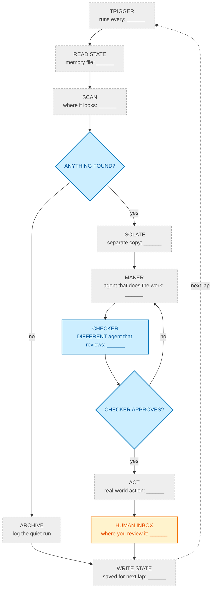
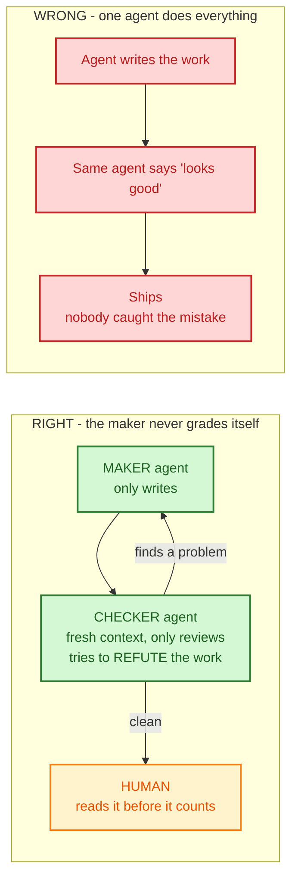

# Agent Harness & Loop Kit

Fill-in-the-blank templates for designing an AI agent harness and the loop that runs it — **without writing code**.

Based on Addy Osmani's [Agent Harness Engineering](https://addyosmani.com/blog/agent-harness-engineering/) and [Loop Engineering](https://addyosmani.com/blog/loop-engineering/). The essays explain the ideas; this repo turns them into blanks you can fill on a Tuesday afternoon.

**No install. No account. No code.** Markdown files and Mermaid diagrams that GitHub draws for you.

---

## Start here

| Step | File | Time |
|---|---|---|
| 1. Read the method | [`GUIDE.md`](GUIDE.md) | 10 min |
| 2. Design the harness | [`templates/harness-canvas.md`](templates/harness-canvas.md) | 30 min |
| 3. Draw it | [`diagrams/harness-anatomy.mmd`](diagrams/harness-anatomy.mmd) → paste into [mermaid.live](https://mermaid.live) | 10 min |

> Only the `.mmd` files are diagram source. The canvases in `templates/` are Markdown worksheets — mermaid.live will reject them.

| 4. Run it by hand ten times | — | a week |
| 5. Design the loop | [`templates/loop-canvas.md`](templates/loop-canvas.md) | 30 min |
| 6. See it done | [`examples/filled-loop-canvas.md`](examples/filled-loop-canvas.md) | 5 min |

Step 4 is not optional and not a formality. The rules that make a harness work are the ones you write *after* watching it fail.

---

## What a loop looks like



Every `______` is yours to fill. Grey = a step you configure. Blue = a gate that stops bad work. Amber = the part that never automates.

---

## The maker never grades itself



---

## What's in the box

```
GUIDE.md                        the method, six steps, no code
templates/
  harness-canvas.md             7 sections - what the agent reads, uses, and may never do
  loop-canvas.md                7 sections - what makes it run without you
  AGENTS.md.template            the rules file, capped at 60 lines
  state.md.template             the memory that survives between runs
diagrams/
  harness-anatomy.mmd           blank, fill and paste into mermaid.live
  loop-cycle.mmd                blank
  maker-checker.mmd             ready to use
examples/
  filled-loop-canvas.md         one boring loop, filled end to end
```

---

## Three rules that carry the rest

1. **A rule is earned, never invented.** Every line in your rules file traces to something that actually went wrong. Delete the rest.
2. **The maker never grades itself.** One agent works, a different one — fresh, with no memory of the first — tries to prove it wrong.
3. **Memory lives on disk.** The model forgets everything between runs. If it isn't in a file, it didn't happen.

---

## License

MIT. Take it, fork it, fill it in.
